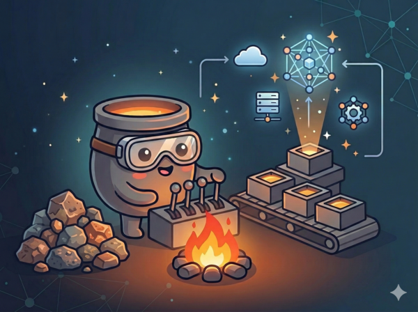

<p align="center">
  
</p>

<h1 align="center">smelt</h1>

<p align="center">
  Declarative infrastructure-as-code with semantic backing, designed for AI reasoning.
</p>

---

Smelt is an opinionated IaC tool that produces canonical, machine-parseable configuration files. Every resource declaration carries semantic metadata — intent, ownership, constraints, lifecycle — so that AI agents can reason about infrastructure changes before executing them.

## Key Ideas

- **Canonical forms** — One unique textual representation per semantic meaning. `smelt fmt` enforces deterministic ordering of sections, fields, and annotations.
- **Semantic sections** — Resource configuration is organized into schema-defined semantic groups (identity, network, security, sizing, reliability) rather than flat key-value pairs.
- **Intent annotations** — Every resource can carry `@intent`, `@owner`, `@constraint`, and `@lifecycle` metadata that is validated and preserved through the toolchain.
- **Dependency resolution** — `needs vpc.main -> vpc_id` automatically injects provider IDs from dependencies into resource configs during apply.
- **Blast radius analysis** — `smelt explain` computes transitive dependency impact before any change is made.
- **Content-addressable state** — Immutable objects hashed with BLAKE3 in a Merkle tree. No single-file corruption risk. Pluggable backends: local filesystem or GCS (with distributed locking via generation-based CAS).
- **Built-in secrets** — AES-256-GCM encryption for `secret()` values. Key rotation with re-encryption. No external Vault required.
- **Signed state transitions** — Ed25519 signatures (via aws-lc-rs) on every state change. SLSA attestations and CycloneDX SBOM generation built in.
- **Safety defaults** — Refresh-before-apply (catches drift), create-before-destroy (prevents data loss), destroy halt-on-error (prevents cascades), `@lifecycle "prevent_destroy"` enforcement.
- **Multi-cloud, honestly** — AWS, GCP, and Cloudflare providers that expose real differences between clouds rather than papering over them with lowest-common-denominator abstractions.

## Installation

```
cargo install --path .
```

Requires Rust 2024 edition (1.85+).

## Quick Start

```bash
# Initialize a project (generates signing key)
smelt init

# Format .smelt files into canonical form
smelt fmt

# Validate configuration and dependency graph
smelt validate

# Show what would change (with color output)
smelt plan production

# Apply changes to infrastructure
smelt apply production

# Explain a resource — intent, dependencies, blast radius
smelt explain vpc.main

# Detect drift between stored state and live cloud
smelt drift production

# Import existing resources
smelt import vpc.main vpc-abc123

# Query stored state
smelt query production --filter vpc

# Show detailed state for a resource
smelt show production vpc.main

# List all environments
smelt envs

# Rollback to a previous state
smelt rollback production abc123def456

# Show dependency graph
smelt graph
smelt graph --dot | dot -Tpng -o graph.png
```

## Example

```
resource vpc "main" : aws.ec2.Vpc {
  @intent "Primary VPC for production workloads"
  @owner "platform-team"

  identity {
    name = "production-vpc"
    tags = { environment = "production", managed_by = "smelt" }
  }

  network {
    cidr_block = "10.0.0.0/16"
    dns_hostnames = true
    dns_support = true
  }
}

resource subnet "public_a" : aws.ec2.Subnet {
  @intent "Public subnet in AZ-a for load balancers"

  needs vpc.main -> vpc_id

  identity {
    name = "public-a"
  }

  network {
    availability_zone = "us-east-1a"
    cidr_block = "10.0.1.0/24"
    public_ip_on_launch = true
  }
}
```

## Supported Resource Types

### AWS (52 resource types across 28 services)

| Service | Resources |
|---------|-----------|
| EC2 | Vpc, Subnet, SecurityGroup, Instance, InternetGateway, RouteTable, NatGateway, ElasticIP, KeyPair, VPC Endpoint |
| IAM | Role, Policy, InstanceProfile |
| S3 | Bucket |
| ELBv2 | LoadBalancer, TargetGroup, Listener |
| ECS | Cluster, TaskDefinition, Service |
| ECR | Repository |
| RDS | DBInstance, DBSubnetGroup |
| Lambda | Function, Permission |
| Route53 | HostedZone, RecordSet |
| CloudWatch | LogGroup, Alarm |
| SQS | Queue |
| SNS | Topic |
| KMS | Key |
| DynamoDB | Table |
| CloudFront | Distribution |
| ACM | Certificate |
| Secrets Manager | Secret |
| SSM | Parameter |
| ElastiCache | ReplicationGroup, ParameterGroup |
| EFS | FileSystem, MountTarget |
| API Gateway | Api, Stage |
| Step Functions | StateMachine |
| EventBridge | Rule, Target |
| Auto Scaling | Group |
| EKS | Cluster, NodeGroup |
| WAFv2 | WebACL |
| Cognito | UserPool |
| SES | EmailIdentity |

### GCP (87 resource types across 33 services, 30 tested, 23 zero-diff)

| Service | Resources |
|---------|-----------|
| Compute | Network, Subnetwork, Firewall, Instance, Route, Address, Disk, Image, and 15 more |
| Cloud Run | Service, Job |
| Cloud SQL | Instance, Database, User |
| IAM | ServiceAccount, IAMBinding |
| Pub/Sub | Topic, Subscription |
| BigQuery | Dataset, Table |
| Secret Manager | Secret |
| Cloud DNS | ManagedZone, RecordSet, DnsPolicy |
| KMS | KeyRing, CryptoKey |
| Artifact Registry | Repository |
| Logging | LogMetric, LogSink, LogView, LogExclusion |
| Monitoring | AlertPolicy, NotificationChannel, UptimeCheckConfig |
| Cloud Storage | Bucket |
| Scheduler | Job |
| Cloud Tasks | Queue |
| Service Directory | Namespace, Service |
| API Keys | Key |
| Container (GKE) | Cluster, NodePool |
| And more | Spanner, AlloyDB, Filestore, Workflows, Functions, etc. |

### Cloudflare (3 resource types)

DNS Record, DNS Zone, Worker Script

### Google Workspace (2 resource types)

User, Group

## Commands

| Command | Description |
|---------|-------------|
| `smelt init` | Initialize project, generate signing keypair |
| `smelt fmt [files...]` | Format files into canonical form (`--check` for CI) |
| `smelt validate [files...]` | Parse, validate contracts, check dependency graph |
| `smelt plan <env> [files...]` | Show what would change (refreshes live state by default, `--no-refresh` to skip) |
| `smelt explain <resource>` | Show intent, deps, blast radius (`--json` for AI) |
| `smelt graph [files...]` | Display dependency graph (`--dot` for Graphviz) |
| `smelt apply <env> [files...]` | Apply changes (`--yes`, `--target`, `--output-file`, `--no-refresh`) |
| `smelt destroy <env> [files...]` | Destroy resources (halts on tier failure, respects `@lifecycle "prevent_destroy"`) |
| `smelt drift <env> [files...]` | Detect drift between stored and live state (`--json`) |
| `smelt import resource <res> <id>` | Import existing cloud resource into state |
| `smelt import discover <type>` | Discover existing cloud resources of a type |
| `smelt import generate <type>` | Generate .smelt file from discovered resources |
| `smelt query <env>` | Query stored state (`--filter`, `--json`) |
| `smelt show <env> <resource>` | Show detailed state for a single resource (`--json`) |
| `smelt rollback <env> <hash>` | Rollback to a previous state tree (`--yes`) |
| `smelt recover <env> <hash>` | Recover from partial apply failure by adopting orphaned tree |
| `smelt diff <env_a> <env_b>` | Compare resources between two environments |
| `smelt envs` | List all environments with state |
| `smelt history <env>` | Show event history for an environment |
| `smelt state ls/rm/mv` | Manage stored state directly |
| `smelt secrets init/encrypt/decrypt/rotate` | Manage AES-256-GCM encryption for secrets |
| `smelt env create/list/delete/show` | Manage project environments |
| `smelt audit trail/verify/attestation/sbom` | Audit trail, integrity verification, SLSA attestations, CycloneDX SBOM |
| `smelt debug <file>` | Dump parsed AST as JSON |

## Environment Layers

Smelt supports environment layers that override base configuration:

```
resource compute "web" : aws.ec2.Instance {
  @intent "Web server"
  sizing {
    instance_type = "t3.large"
  }
}

layer "staging" over "base" {
  override compute.* {
    sizing {
      instance_type = "t3.small"
    }
  }
}
```

Layers merge additively — they override matching fields while preserving everything else.

## AI Integration

Smelt is designed to be used by AI agents. The `--json` flag on `plan`, `explain`, `drift`, `query`, and `show` produces structured output that agents can parse and reason about. The canonical formatting means agents can reliably read and write `.smelt` files without ambiguity.

```bash
# Structured output for AI consumption
smelt plan production --json
smelt explain vpc.main --json
smelt query production --json
smelt drift production --json

# AST dump for programmatic analysis
smelt debug infrastructure.smelt
```

## Architecture

```
.smelt files -> parser -> AST -> graph -> plan -> apply -> state store
                          |        |        |
                        format  explain   sign
```

See [ARCHITECTURE.md](ARCHITECTURE.md) for details on the module structure, data flow, and design decisions.

## Security

- **Sensitive field redaction** — Passwords and secrets are automatically stripped from stored state
- **Signing key protection** — Ed25519 key files have 0600 permissions (owner-only)
- **Safe deletion defaults** — RDS creates final snapshots, secrets have 30-day recovery windows, KMS keys have 30-day pending deletion
- **Audit trail** — Every state change is logged with actor identity, timestamp, and intent
- **Cryptographic integrity** — BLAKE3 content hashing, Ed25519 signed transitions via [aws-lc-rs](https://github.com/aws/aws-lc-rs) (FIPS-validated)
- **Dependency auditing** — [cargo-deny](https://github.com/EmbarkStudios/cargo-deny) enforces license, advisory, and source policies (see `deny.toml`)
- **No openssl** — `aws-lc-rs` + `rustls` only; `openssl` is banned in `deny.toml`

See [SECURITY.md](SECURITY.md) for the security policy and threat model.

## Remote State

Configure GCS backend in `smelt.toml` for team collaboration:

```toml
[state]
backend = "gcs"
bucket = "my-smelt-state"
prefix = "state/"
```

GCS backend uses generation-based compare-and-swap for distributed locking — no DynamoDB table needed. BLAKE3 integrity verification works identically over any backend. The `StorageBackend` trait is composable: implementing S3 or Azure Blob is a single trait impl.

## Testing

```bash
# Run all tests (155 total: 117 unit + 17 integration + 21 property-based)
cargo test

# Run property-based tests only
cargo test --test property_tests

# Run with cargo-deny checks
cargo deny check
```

Property-based tests (via [proptest](https://docs.rs/proptest)) verify:
- Parser/formatter roundtrip idempotency
- Content-addressable store integrity
- Diff engine correctness (identity, coverage, inverse symmetry)
- Signing roundtrip and tamper detection
- Config roundtrip serialization
- Secret encryption/decryption roundtrip

## License

MIT
